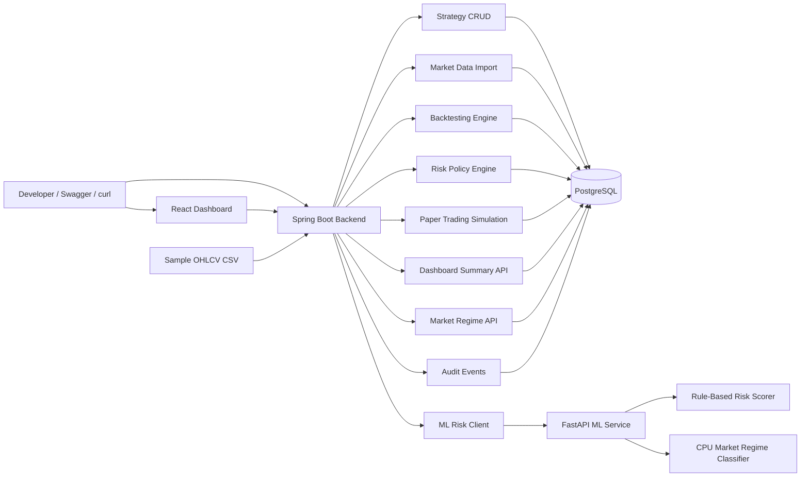

# SignalAttention Architecture

## Runtime Services

- `postgres`: Stores strategies, candles, backtests, trades, risk policies, paper sessions, positions, orders, and audit events.
- `backend`: Owns REST APIs, validation, persistence, deterministic backtesting, risk evaluation, paper trading, dashboard aggregation, and market regime proxying.
- `ml-service`: Provides CPU-first rule-based strategy risk scoring and market regime classification.
- `frontend`: Provides a local React dashboard/workbench for importing candles, creating SMA strategies, running backtests, scoring ML risk, managing paper sessions, and reviewing summary, strategy performance, audit, and market regime status.

## Market Regime Modes

The market regime endpoint defaults to `MARKET_REGIME_MODE=rules`. This path uses deterministic feature extraction and rule-based labels, stays CPU-only, and is the mode used by the default Docker Compose setup.

`MARKET_REGIME_MODE=torch` is reserved for an optional model-backed classifier. It requires `MARKET_REGIME_ARTIFACT_PATH` and the optional Torch dependencies; the default service does not require PyTorch or GPU drivers.

## Current Boundaries

- No real-money trading, broker integration, custody, trade recommendations, or live order execution. These are permanent boundaries, not deferred roadmap items.
- No authentication or multi-user model yet.
- No trained attention/PyTorch model yet; the current market regime path is deterministic and CPU-safe.
- The dashboard is local and unauthenticated; account isolation remains future scope.
