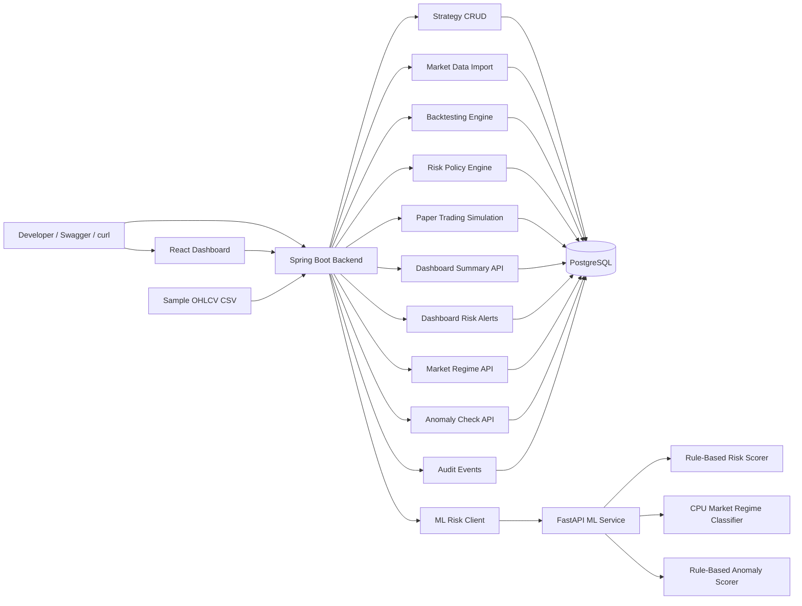

# SignalAttention Architecture



## Runtime Services

- `postgres`: Stores strategies, candles, backtests, trades, risk policies, paper sessions, positions, orders, and audit events.
- `backend`: Owns REST APIs, validation, persistence, deterministic backtesting, equity/drawdown chart data, risk evaluation, paper trading, dashboard aggregation, derived risk alerts, market regime proxying, and anomaly proxying.
- `ml-service`: Provides CPU-first rule-based strategy risk scoring, market regime classification, and anomaly checks.
- `frontend`: Provides a local React dashboard/workbench for importing candles, creating SMA strategies, running backtests, scoring ML risk, managing paper sessions, and reviewing summary, charts, risk alerts, strategy comparison, audit, anomaly, and market regime status.

## Market Regime Modes

The market regime endpoint defaults to `MARKET_REGIME_MODE=rules`. This path uses deterministic feature extraction and rule-based labels, stays CPU-only, and is the mode used by the default Docker Compose setup.

`MARKET_REGIME_MODE=torch` enables the optional model-backed classifier. It requires `MARKET_REGIME_ARTIFACT_PATH` and the optional Torch dependencies; the default service does not require PyTorch or GPU drivers.

Torch artifacts are dictionaries saved with `torch.save` and must contain:

- `metadata.sequenceLength`
- `metadata.featureOrder`, matching the service feature order
- `metadata.labels`
- optional `metadata.normalization.mean` and `metadata.normalization.std`
- optional `metadata.model` Transformer settings
- `modelStateDict`

Create a local research artifact with:

```bash
cd ml-service
pip install -r requirements-torch.txt
python scripts/train_market_regime_model.py \
  --csv-path ../data/btc-usd-1h-sample.csv \
  --output models/market-regime.pt \
  --cpu --seed 42 --batch-size 32 --patience 10
python scripts/evaluate_market_regime_model.py \
  --csv-path ../data/btc-usd-1h-sample.csv \
  --artifact models/market-regime.pt \
  --output models/market-regime-evaluation.json \
  --holdout-ratio 0.2
python scripts/compare_market_regime_experiments.py \
  --experiments-dir models/experiments
```

The training command runs a seeded, mini batch loop with per epoch validation and early stopping, keeps the best epoch, and saves `models/market-regime.pt.manifest.json` beside the artifact with the seed, git commit, torch version, model config, and per epoch history. The model uses light dropout and sinusoidal positional encoding by default, both adjustable from the command line. The evaluation command saves accuracy, per label metrics, a confusion matrix, a confidence summary, and sample predictions, plus a majority class baseline and the lift over it so the rule derived labels are read honestly rather than as ground truth. Each run is recorded in `models/experiments/index.json` under its own run id, and the compare script prints those runs sorted by accuracy. Torch mode API responses include optional provenance fields so the dashboard can identify mode, model version, feature version, sequence length, and artifact name.

The optional Compose profile exposes a torch-enabled ML service on port `8001`:

```bash
docker compose --profile torch up --build ml-service-torch
```

## Current Boundaries

- No real-money trading, broker integration, custody, trade recommendations, or live order execution. These are permanent boundaries, not deferred roadmap items.
- No authentication or multi-user model yet.
- The current default market regime path is deterministic and CPU-safe; torch inference is optional and artifact-backed.
- The dashboard is local and unauthenticated; account isolation remains future scope.
- Anomaly checks are deterministic research warnings based on recent candles, not trade signals.
