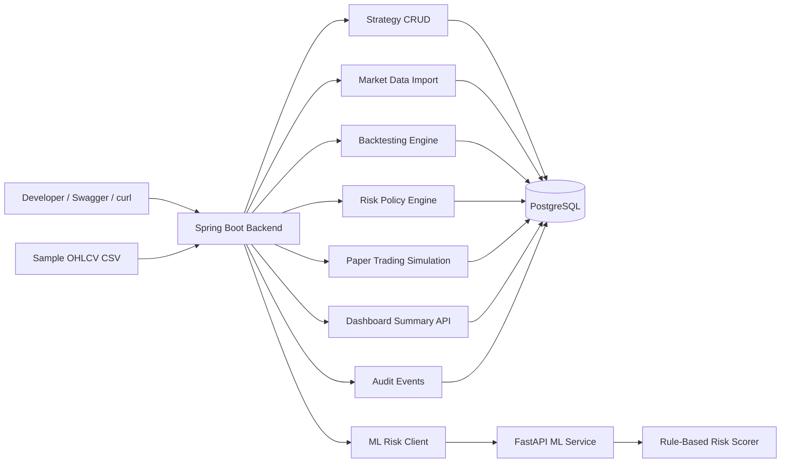

# SignalAttention Architecture

## Runtime Services

- `postgres`: Stores strategies, candles, backtests, trades, risk policies, paper sessions, positions, orders, and audit events.
- `backend`: Owns REST APIs, validation, persistence, deterministic backtesting, risk evaluation, paper trading, and dashboard aggregation.
- `ml-service`: Provides CPU-first rule-based strategy risk scoring.

## Current Boundaries

- No real-money trading or broker integration.
- No authentication or multi-user model yet.
- No trained attention/PyTorch model yet.
- Dashboard support is backend API only; no frontend is included.
